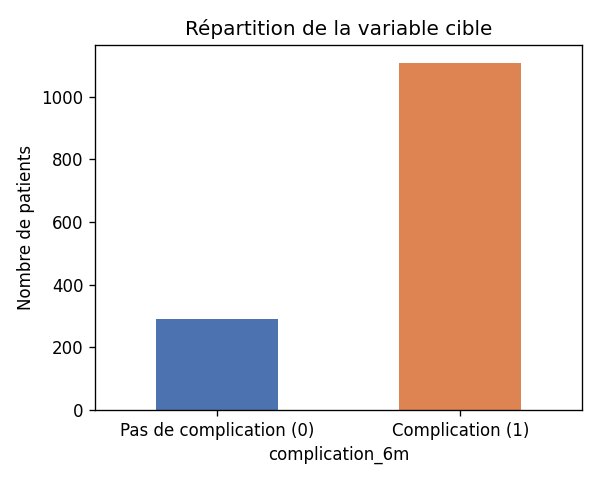
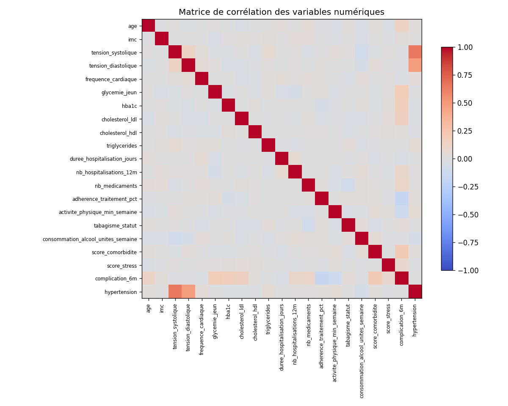
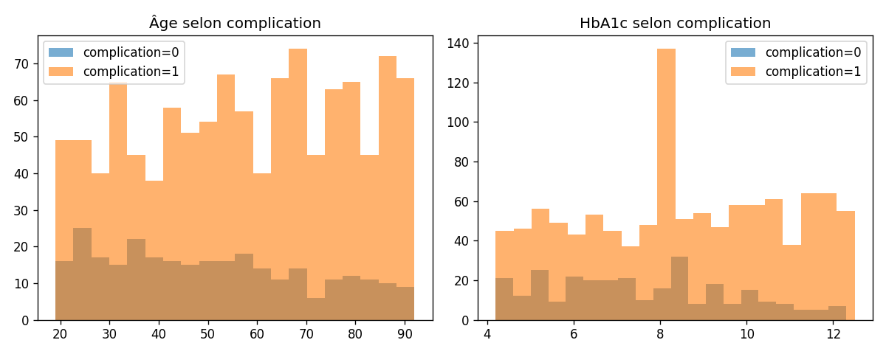

# Prédiction des complications de santé à 6 mois

Projet de machine learning (classification binaire) prédisant si un patient
développera une complication de santé dans les 6 mois, à partir de données
cliniques (tension, glycémie, HbA1c, cholestérol, comorbidités, mode de
vie...).

## Pourquoi ce projet

Projet initialement réalisé sous forme d'un unique notebook exploratoire de
137 cellules. Cette version est une refonte complète : code source réutilisable
dans `src/`, notebook de rapport nettoyé, artefacts de modèle validés, et
documentation.

## Structure du repo

```
.
├── data/
│   ├── raw/                     # CSV brut (source)
│   └── processed/                # dataset nettoyé (généré, non versionné)
├── src/
│   ├── data_cleaning.py          # nettoyage du dataset (fonctions unitaires)
│   ├── train_model.py            # entraînement, comparaison, sauvegarde du modèle
│   └── predict.py                # inférence sur un nouveau patient
├── notebooks/
│   └── rapport_projet.ipynb      # rapport lisible (exploration + modélisation)
├── models/                       # artefacts générés (.pkl, metrics.json)
├── outputs/figures/               # graphiques générés à partir des vraies données
├── docs/
│   └── exemple_patient.json      # exemple d'entrée pour predict.py
├── requirements.txt
├── .gitignore
└── LICENSE
```

## Installation

```bash
python -m venv .venv
source .venv/bin/activate  # Windows : .venv\Scripts\activate
pip install -r requirements.txt
```

## Utilisation

**1. Nettoyer les données**
```bash
cd src
python data_cleaning.py ../data/raw/projet3_sante_complications.csv ../data/processed/dataset_clean.csv
```

**2. Entraîner le modèle**
```bash
python train_model.py --data ../data/raw/projet3_sante_complications.csv --output-dir ../models
```
Génère `models/modele_final.pkl`, `models/feature_columns.pkl` et
`models/metrics.json`.

**3. Prédire pour un nouveau patient**
```bash
python predict.py --model ../models/modele_final.pkl \
                   --features ../models/feature_columns.pkl \
                   --input ../docs/exemple_patient.json
```

## Données et nettoyage

Le CSV source (1510 lignes) contient des valeurs volontairement "sales" :
espaces parasites dans les noms de colonnes, virgules décimales (`50,4`),
unités mélangées au texte (`145 mg/L`), préfixes/suffixes (`age:88`, `86 ans`),
catégories de sexe non standardisées (`M`, `Femme`, `h`, `homme`...), et
incohérences physiologiques (tension systolique ≤ diastolique).

Après nettoyage (`src/data_cleaning.py`) : **1400 patients, 22 variables**,
aucune valeur manquante, aucun doublon.

La cible `complication_6m` est déséquilibrée :



- Complication (1) : **79.2 %**
- Pas de complication (0) : **20.8 %**

Matrice de corrélation des variables numériques :



Âge et HbA1c selon le statut de complication :



## Modélisation

Trois modèles sont comparés : **Logistic Regression**, **Random Forest**,
**Gradient Boosting**, dans un `Pipeline` scikit-learn (imputation médiane
apprise sur le train uniquement + gestion du déséquilibre de classes via
**SMOTE**, appliqué uniquement sur les plis d'entraînement).

Résultats obtenus lors de l'exécution originale du notebook fourni, avec
SMOTE réellement exécuté (sélection du "meilleur" modèle par **accuracy**,
critère utilisé dans cette version d'origine) :

| Modèle | Accuracy | F1 macro |
|---|---|---|
| Logistic Regression + SMOTE | 0.786 | 0.71 |
| Random Forest + SMOTE | **0.821** | 0.66 |
| Gradient Boosting + SMOTE | 0.821 | **0.71** |

Modèle retenu à l'époque (accuracy la plus haute, premier trouvé) : **Random
Forest + SMOTE** — c'est l'artefact `modele_final.pkl` fourni au départ pour
cette refonte.

`src/train_model.py` (code de production réécrit) change volontairement le
**critère de sélection : F1 macro plutôt qu'accuracy**, plus pertinent sur un
jeu déséquilibré (l'accuracy favorise artificiellement les modèles qui
prédisent surtout la classe majoritaire). Avec ce critère et en cas d'égalité,
c'est le **Logistic Regression + SMOTE** qui serait retenu (F1 macro = 0.71,
premier modèle à atteindre ce score). **Ce choix diffère donc potentiellement
du modèle d'origine** — assumé ici comme une amélioration méthodologique, à
garder en tête si vous comparez les deux exécutions.

> ⚠️ **Note d'exécution** : l'environnement utilisé pour valider cette refonte
> n'a pas d'accès réseau et n'a donc pas pu installer `imbalanced-learn` pour
> ré-exécuter la variante SMOTE. Le pipeline complet (`src/train_model.py`,
> `notebooks/rapport_projet.ipynb`) a néanmoins été exécuté de bout en bout
> avec succès, en utilisant automatiquement le repli `class_weight="balanced"`
> quand `imbalanced-learn` est absent (voir `models/metrics.json`, généré par
> cette exécution de repli — modèle retenu dans ce cas : Logistic Regression,
> F1 macro 0.72). Les chiffres du tableau ci-dessus proviennent de
> l'exécution originale du notebook fourni par vous (SMOTE réellement
> exécuté), pas d'une exécution que j'ai faite moi-même. **Chez vous**, avec
> `pip install -r requirements.txt`, `train_model.py` utilisera directement
> SMOTE.

## Bugs corrigés par rapport à la version originale

- Import dupliqué de `matplotlib.pyplot`.
- Étape de sélection des "11 colonnes" annoncée en markdown mais jamais
  appliquée (code mort) : supprimée.
- Nettoyage de `hba1c` : l'étape "traitement des valeurs manquantes" annoncée
  correspondait à une cellule vide jamais exécutée ; la fonction
  `clean_hba1c` impute désormais explicitement les valeurs manquantes.
- **Fuite mineure train/test** : le notebook original imputait les NaN
  restants de `X_test` avec la médiane calculée sur `X_test` lui-même
  (`X_test.fillna(X_test.median())`). Corrigé : l'imputation est apprise
  uniquement sur `X_train` via `SimpleImputer` intégré au pipeline.
- **Deux rounds de modélisation dupliqués** (mêmes 3 modèles entraînés deux
  fois, variables réécrasées `rf_model`, `results`...) : consolidés en un seul
  pipeline final (SMOTE), le round baseline étant conservé à titre de
  comparaison pédagogique dans le notebook de rapport.
- **`scaler.pkl` orphelin** : ajusté sur les données du round 1 (baseline),
  il n'était utilisé par aucun code au moment de l'inférence avec le modèle
  final (round 2, SMOTE, qui n'a pas de scaler dans son pipeline). Il n'est
  plus généré séparément : le scaling nécessaire (régression logistique) est
  désormais intégré au pipeline sauvegardé.
- `random_state=42` uniformisé sur tous les modèles et le split (déjà présent
  dans l'original, conservé).

## Ce qu'il reste à faire

- Si vous voulez reproduire exactement les résultats SMOTE indiqués
  ci-dessus : `pip install -r requirements.txt` (accès réseau requis, non
  disponible dans l'environnement où cette refonte a été validée) puis
  relancer `python src/train_model.py`.
- Remplacer les métadonnées de `LICENSE` (nom de l'auteur) si besoin.
- `git init`, ajouter les fichiers, commit, puis créer le dépôt GitHub et
  `git push`.

## Stack technique

Python 3.12 · pandas · scikit-learn · imbalanced-learn (SMOTE) · joblib ·
matplotlib

## Licence

MIT — voir [LICENSE](LICENSE).
